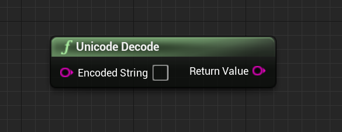
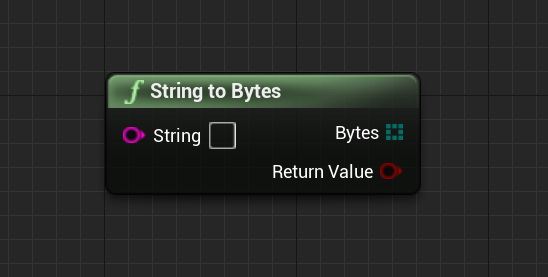
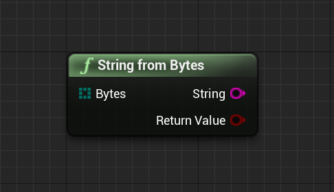
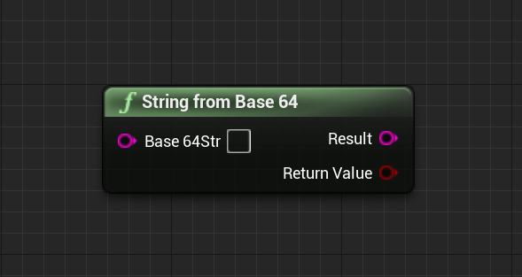

Easily convert String to URL, Unicode, Bytes, Base64 format data freely.

1.Convert FString to URL

 

2.Convert FString from URL

 

3.Convert FString to Unicode

 

4.Convert FString from Unicode

 

5.Convert FString to Bytes

 

6.Convert FString from Bytes

 

7.Convert FString to Base64

 

8.Convert FString from Base64

 

Overall preview

 

 

 

 